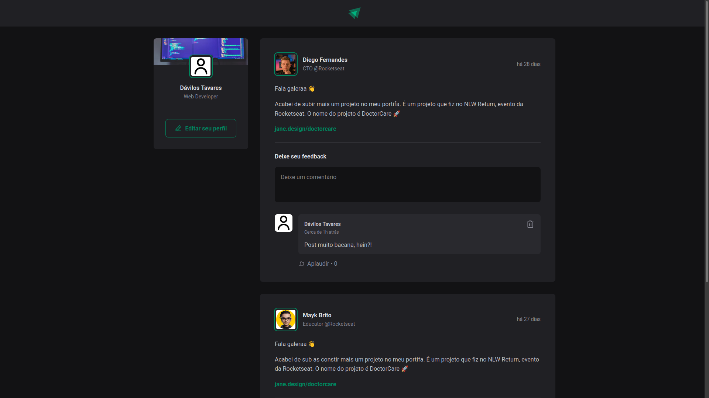

# Ignite Feed

Ignite feed is a project that simulates a social media with posts, comments and likes.

## Run

1. Install dependencies:
`pnpm i`

2. Initialize the project:
`pnpm run dev`

## Technologies

<ul>
  <li>TypeScript</li> 
  <li>ReactJS</li> 
  <li>Vite</li> 
  <li>React Router Dom</li> 
  <li>Date-fns</li> 
</ul>
